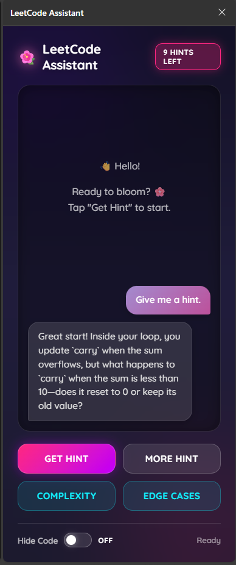
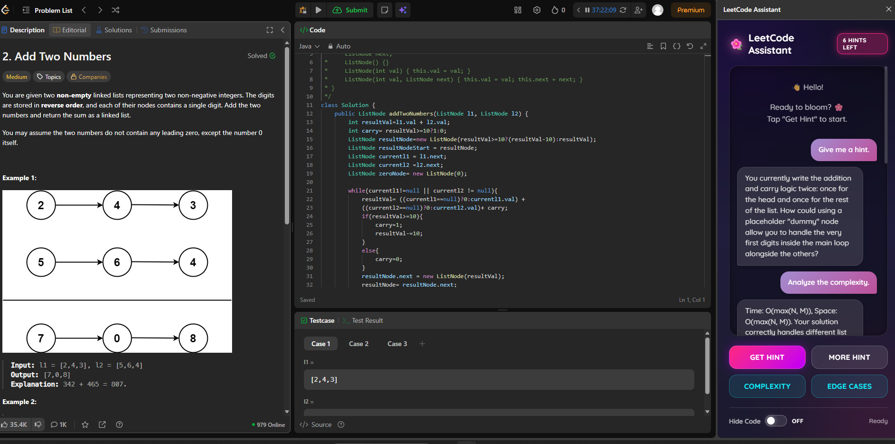
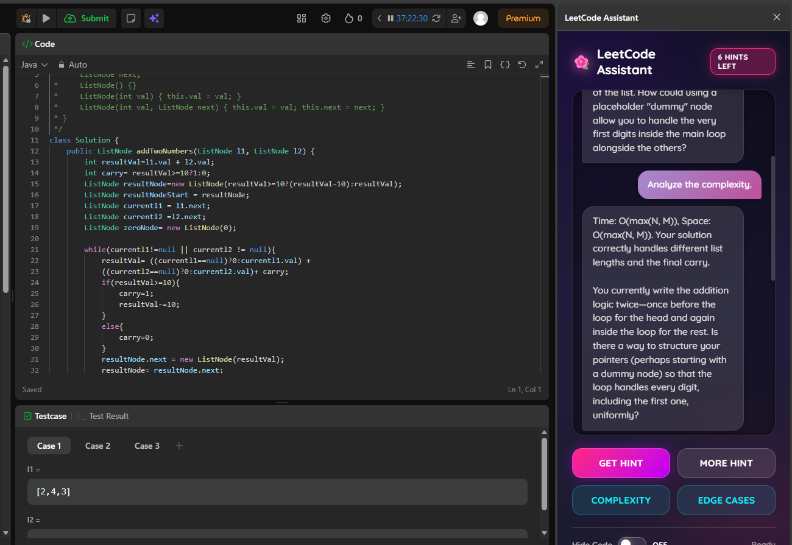
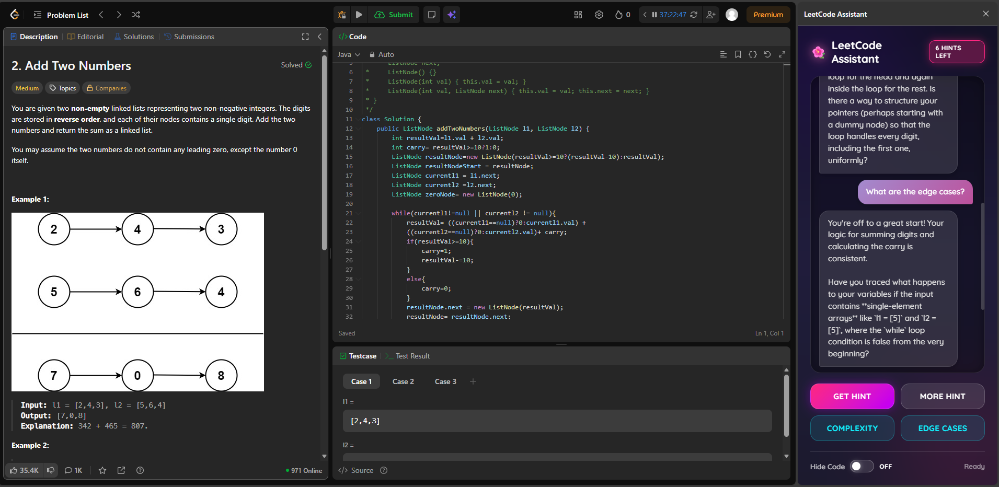

# LeetCode Assistant

**LeetCode Assistant** is an AI-powered Chrome Extension designed to act as a supportive coding coach. It helps you solve LeetCode problems by providing Socratic hints, complexity analysis, and edge case suggestions without giving away the solution immediately.

<p align="center">
  
</p>

## Features

*   **Get Hint**: Receive a subtle nudge based on your current code and the problem description.
    <p align="center">
      
    </p>
*   **Complexity Analysis**: Get feedback on the Time and Space complexity of your current approach.
    <p align="center">
      
    </p>
*   **Edge Cases**: Discover potential failing inputs or corner cases you might have missed.
    <p align="center">
      
    </p>

*   **Progressive Help**: Use "More Hint" for deeper guidance if you are still stuck.
*   **Give Up**: Reveals the intuition and full solution when you've exhausted your attempts.
*   **Hint Limits**: Limited to 10 hints per session to encourage independent thinking.
*   **Safety**: Built-in guardrails against prompt injection and excessive input size.

## Project Structure

```
.
├── backend/                 # FastAPI Python Backend
│   ├── main.py             # Entry point & Safety Middleware
│   ├── test.py             # Integration Tests
│   ├── controllers/        # API Routes (hint, complexity, edge_cases)
│   ├── services/           # Business Logic
│   │   ├── llmClient.py    # Google Gemini Interface
│   │   ├── ragEngine.py    # RAG Implementation (Embeddings & Retrieval)
│   │   └── safety.py       # Input Validation & Injection Detection
│   ├── config/             # Prompts and Configuration
│   └── requirements.txt    # Python dependencies
├── extension/               # Chrome Extension (Manifest V3)
│   ├── manifest.json       # Extension Configuration
│   ├── popup.html          # Side Panel UI
│   ├── popup.js            # UI Logic & API Calls
│   ├── content.js          # Isolated World Script (Bridge)
│   └── pageScript.js       # Main World Script (Monaco Access)
└── README.md
```

## Setup Instructions

### 1. Quick Start (Recommended)
Run the automated setup script to create the virtual environment, install dependencies, configure your API key, and start the server:

```bash
chmod +x run.sh
./run.sh
```

### 2. Manual Backend Setup
If you prefer manual configuration:
1.  Navigate to the `backend` directory.
2.  Create a virtual environment and activate it:
    ```bash
    python3 -m venv venv
    source venv/bin/activate
    ```
3.  Install dependencies:
    ```bash
    pip install -r requirements.txt
    ```
4.  Create a `.env` file in `backend/config/` with your Google Gemini API key:
    ```env
    GEMINI_API_KEY=your_api_key_here
    ```
5.  Run the server:
    ```bash
    uvicorn main:app --reload
    ```

### 2. Extension Setup
1.  Open Chrome and go to `chrome://extensions`.
2.  Enable **Developer mode** (top right toggle).
3.  Click **Load unpacked**.
4.  Select the `extension` folder from this project.
5.  Go to a LeetCode problem page and open the Chrome Side Panel.

## Technical Implementation

### Frontend (Chrome Extension)
The frontend is built using **HTML5, CSS3, and Vanilla JavaScript** within the Chrome Extension Manifest V3 architecture.
*   **User Flow**: The user opens a LeetCode problem, clicks "Get Hint" in the side panel, and receives an AI-generated hint based on their specific code state.
*   **Secure Code Extraction**: Uses a dual-script strategy (`pageScript.js` in MAIN world, `content.js` in ISOLATED world) to bypass CSP and access the Monaco editor instance safely.
*   **UX Polish**: Includes loading states ("Thinking..."), error handling, a "Hints Left" counter, and a "Give Up" flow that clears the chat for a fresh start.

### Backend & AI
-   **FastAPI**: Handles requests and manages safety (input validation, injection detection).
-   **Google Gemini**: Generates context-aware hints using a "Socratic Coach" system prompt.
-   **RAG (Retrieval Augmented Generation)**: Implemented in `ragEngine.py`. It uses `text-embedding-004` to embed the current problem description and retrieves similar solved problems from `vectorStore.json`. This context allows the AI to provide more relevant and accurate hints based on proven solutions.
-   **Safety & Robustness**: Implemented in `safety.py`. The `InputValidator` scans all incoming requests for prompt injection patterns (e.g., "ignore previous instructions") and enforces input length limits to prevent abuse.
-   **Telemetry & Logging**: The `LLMClient` logs every interaction, including timestamp, latency, token usage, and the specific RAG pathway used. This data is crucial for monitoring system performance and cost.
-   **Rate Limiting**: To ensure fair usage and prevent API exhaustion, the system enforces a limit of 10 hints per session. This is tracked client-side in the extension and can be enforced server-side via token buckets if needed.
-   **Testing**: Integration tests are available in `backend/test.py` to verify all API endpoints (`/hint`, `/complexity`, `/edge_cases`) against expected response patterns. The test suite validates that the AI behaves as a Socratic coach and does not leak solutions.

### RAG Implementation Details
The Retrieval Augmented Generation system (`ragEngine.py`) enhances hint quality by providing the LLM with "solved examples" of similar problems.
1.  **Embedding**: We use Google's `text-embedding-004` model to convert the current problem description into a high-dimensional vector.
2.  **Retrieval**: We calculate the cosine similarity between this vector and our pre-computed database of solved LeetCode problems (`vectorStore.json`).
3.  **Context Injection**: The top 3 most similar problems (and their solutions) are injected into the system prompt. This allows Gemini to say, *"This problem is similar to '3Sum', where we used a two-pointer approach..."* without hallucinating.

## Project Grading Criteria Checklist

| Category | Requirement | Implementation Details |
| :--- | :--- | :--- |
| **Core** | Real user flow calling LLM | "Get Hint", "Complexity", and "Edge Cases" buttons trigger full backend -> LLM pipeline. |
| **Enhancement** | RAG (Embed + Vector Search) | `ragEngine.py` uses `text-embedding-004` + cosine similarity on `vectorStore.json`. |
| **Safety** | System Prompt Do/Don't Rules | `prompts.json` defines strict Socratic persona and solution-hiding rules. |
| **Safety** | Input Length Guard | `main.py` middleware blocks payloads > 20KB. |
| **Safety** | Prompt Injection Check | `safety.py` scans for patterns like "ignore previous instructions". |
| **Telemetry** | Log timestamp, pathway, latency | `llmClient.py` logs structured JSON telemetry for every call. |
| **Eval** | Offline Eval Script | `backend/test.py` runs integration tests against expected regex patterns. |
| **Repro** | One-command run | `./run.sh` sets up env, installs deps, and starts server. |
| **Bonus** | Rate Limiting | Client-side session limit (10 hints) + Server-side exponential backoff for LLM 429 errors. |
| **Bonus** | UX Polish | Loading states, hint counter, modern CSS. |

